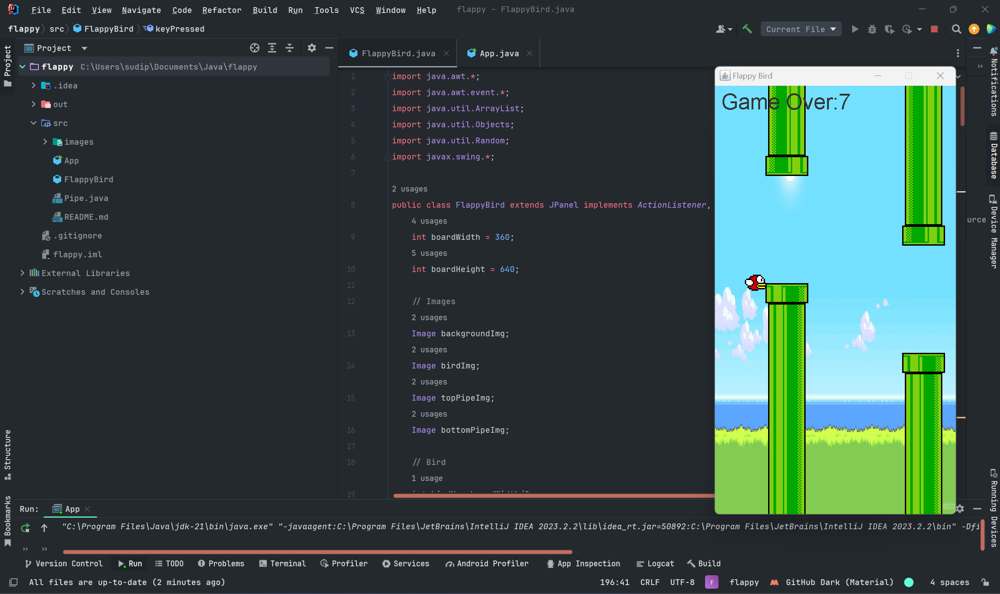

# Flappy Bird

## Introduction
Flappy Bird is a simple game implemented in Java using Swing. It simulates the popular Flappy Bird game where the player controls a bird, attempting to fly between rows of green pipes without hitting them.



## How to Play
- Press the spacebar to make the bird flap its wings and ascend.
- Avoid colliding with the pipes.
- Try to achieve the highest score possible by passing through as many pipes as you can.

## Controls
- Press the spacebar to start/restart the game.
- Use the spacebar to control the bird's altitude.

## Dependencies
- Java Development Kit (JDK)
- Swing library

## Usage
1. Clone this repository.
2. Compile the Java files using `javac`.
3. Run the compiled Java file `App.java` to start the game.

```bash
javac *.java
java App
